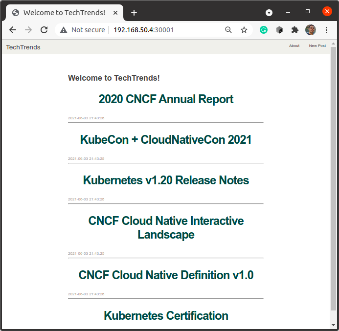

# Cloud Native Application Architecture Nanodegree

## TechTrends Project

Sharing platform project for **Cloud Native Fundamentals** module.

## Tech Stack

### Web App
* [Python](https://www.python.org/downloads/)
* [Flask](https://flask.palletsprojects.com/)
* [SQLite](https://www.sqlite.org/)

### Containerization & Virtualization
* [Docker](https://www.docker.com/)
* [Vagrant](https://www.vagrantup.com/)

### CI/CD & GitOps
* [Github Actions](https://github.com/features/actions)
* [ArgoCD](https://argoproj.github.io/argo-cd/)

### Deployment & Management of Containers
* [Kubernetes](https://kubernetes.io/)
* [K3S](https://k3s.io/)

## Running TechTrends Project

### Building TechTrends Image

From the repository's root folder, build the app image:

```
$docker build -t YOUR_NAME/techtrends .
```

The build process will install all dependencies and start the SQLite DB, then expose port `3111` for this image.

You might want to test the application before building its image by reading the [instructions here](techtrends/README.md).

### Running the Image

Run a container and test it locally:

```
docker run -d --name techtrends -p HOST_PORT:3111 YOUR_NAME/techtrends
```

### Preparing K8S Environment

With vagrant correctly setup, a simple `vagrant up` and `vagrant ssh` will suffice to start the environment.

As superuser, install K3S, a lightweight K8S distribution: `curl -sfL https://get.k3s.io | sh -`

This installation process may take a while. 

Check the availability with `kubectl get node`.

### Applying K8S Manifests Only

Apply the *kubernetes/namespace.yaml*, *kubernetes/deploy.yaml* and *kubernetes/service.yaml* for local/sandbox namespace.

```shell
$ kubectl apply -f namespace.yaml
$ kubectl apply -f deploy.yaml
$ kubectl apply -f service.yaml
```

Check the resources created for the *sandbox* namespace:

```shell
$ kubectl get all -n sandbox

NAME                              READY   STATUS    RESTARTS   AGE
pod/techtrends-577bd4f766-nmchn   1/1     Running   1          44h

NAME                 TYPE        CLUSTER-IP     EXTERNAL-IP   PORT(S)    AGE
service/techtrends   ClusterIP   10.43.170.37   <none>        4111/TCP   44h

NAME                         READY   UP-TO-DATE   AVAILABLE   AGE
deployment.apps/techtrends   1/1     1            1           44h

NAME                                    DESIRED   CURRENT   READY   AGE
replicaset.apps/techtrends-577bd4f766   1         1         1       44h
```

Test the service from cluster ip:

```shell
$ curl -s -i 10.43.170.37:4111 | head -n 1 -
```

Expose as a node port to test from your local browser:

```
$ kubectl apply -f nodeport.yaml
```

Check the webapp running from VM private ip and node port exposed, i.e, `192.168.50.4:30001`



